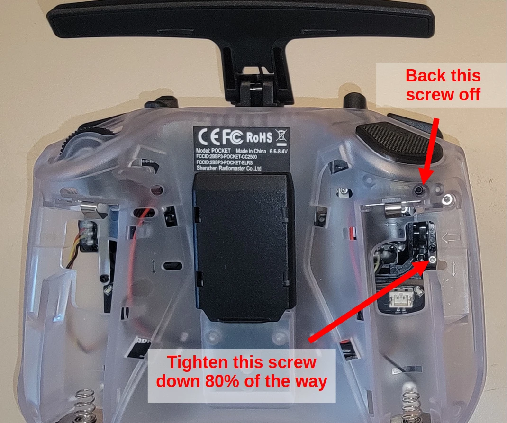
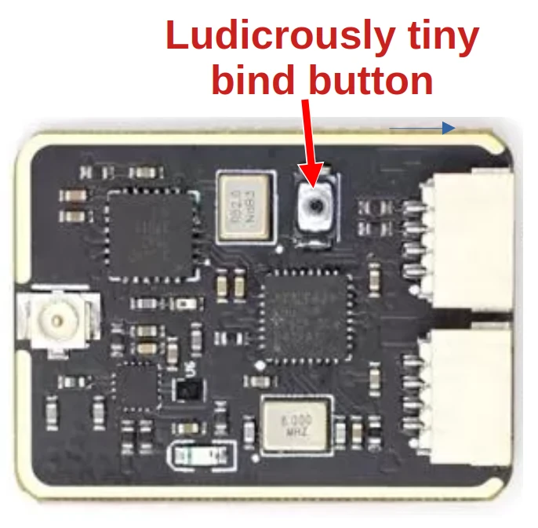

# Radio and Telemetry

The Pixhawk has two communication ports, one for the telemetry and one for the RC controller. We've chosen a setup in which the Remote Control (RC) and telemetry share a single receiver board, allowing us to both control the drone from a handheld controller and send/receive information such as flight data, mission plans, etc to and from the drone from a computer or phone running QGroundControl, Mission Planner, or similar.

## RC
We're using the [Radiomaster Pocket](https://radiomasterrc.com/products/pocket-radio-controller-m2) RC controller (the [ELRS](https://www.expresslrs.org/) version). This RC controller runs [EdgeTX](https://edgetx.org/), an open source RC firmware that works across a range of RC controllers from vaious manufacturers.

### Stuff about the RC controller
As mentioned above, the RC controller shares the receiver with the telemetry radio.

Since the RC controller runs EdgeTX, most of the relevant information on how to set up and operate it is found in the [EdgeTX manual](https://manual.edgetx.org/bw-radios/model-select/setup).

#### Physical setup
You'll want the left stick (throttle vertically and yaw horizontally in normal Mode 2 drone control schemes) to auto-center vertically (it already auto-centers horizontally, and the right stick auto-centers in both axes). There are a pair of screws that control the gimbal centering on the throttle stick.

Turn the controller upside-down, take a 1.5 mm hex key, and do like the picture says.



Get some 18650 batteries with flat—not button—tops. Make sure they're not longer than 650 mm (some 18650 batteries are a few mm longer than 650 because they incorporate a safety circuit; that sounds nice but they won't fit in the controller). Put these batteries in the compartment under the rubber grippy covers, which can be peeled off with a thumbnail.

## Telemetry
For telemetry, we're using the [Micoair TRS TX transmitter and reciever module](https://micoair.com/trs_tx_module_receiver/).

The Micoair system has two components,

- A transceiver that mounts on the back of the RC controller as an "External RF" radio (the RC controller contains an "Internal RF" radio and can therefore work standalone communicating with a receiver, but when the external RF radio is mounted on the back of it the controller's internal radio transceiver is not used).
- A transceiver onboard the drone that communicates with both the RC controller and the telemetry module.
  - This transceiver has two output cables (bundle of wires), one of which plugs into the ```Telem1``` socket on the flight controller, and the other one which plugs into the ```PPM/SBUS RC``` socket, effectively taking the place of what previous generations of drone would have used two separate pieces of radio gear for. 
  - This transceiver onboard the drone is sometimes referred to as the "receiver" though it's actually both transmitting and receiving. Historically, RC vehicles were actually equipped with receivers that passed control impulses from the RC controller to the vehicle, so people often still refer to the onboard transceiver as a "receiver." In this case, it's transmitting quite a lot of information ("telemetry") back to the flight control software!

## Setup
### Micoair
The ground-based and drone-based transceivers need to be "bound" to one another as a pair before they'll communicate. The procedure to do so is:
- Mount the ground-based transceiver on the RC controller and turn it on.
- Remove power from the drone-based transceiver (you can unplug it)
- Press and hold the [tiny binding button on the drone-based transceiver](Images/bind_button.jpg) and turn it back on again. The LED light will start blinking quickly, indicating that it's in binding mode. 
- While continuing to hold the bind button, turn the RC controllor off and on again, which will power cycle the ground-based transceiver mounted to it and cause it to bind to the drone-based transceiver after a few seconds.



This procedure is documented [on Micoair's website on this page](https://micoair.com/trs_tx_module_receiver/), but—amazingly annoyingly—you can't see the instructions until you scroll down a bit and click the "Specifications" tab. 

