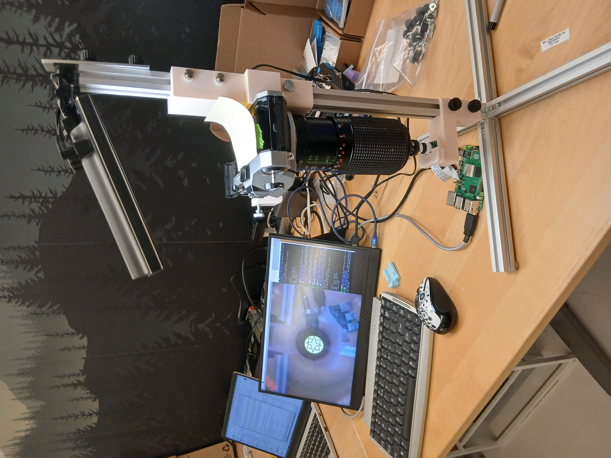
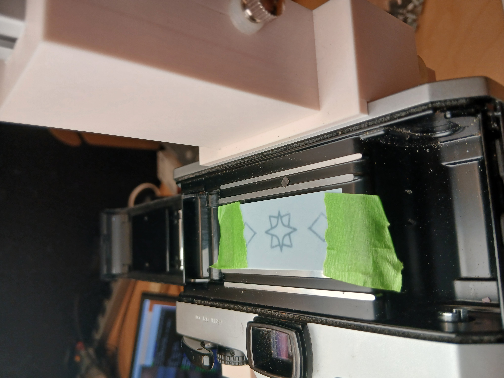
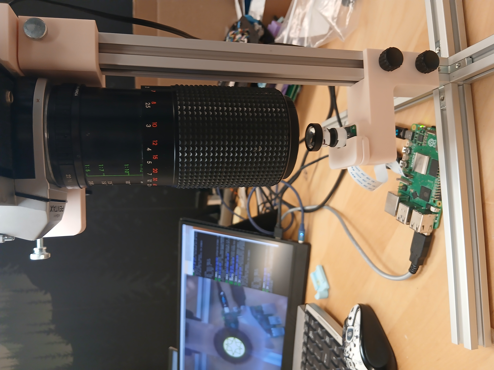

# Camera Collimator

The Arducam (or whatever camera we're using to capture imagery from the drone) should be set to infinity focus to take clear pictures of the ground, which will typically be 80-150 m below the vehicle and lens.

Lens collimation is a process of setting a lens to infinity focus using a second lens, which allows us to reproducibly set the cameras to infinity focus without relying on variable outdoor light conditions and optical targets.

We've designed a collimation system using an old Single Lens Reflex camera and a set of rails. Our system is largely based on [Mike Elek's outstanding blog post](https://elekm.net/zeiss-ikon/repair/collimate/) on lens collimation.

## Hardware

We used the following items to build the collimator setup:

- A used Pentax K100 Single-lens Reflex camera off Craiglist (any non-digital SLR will do)
- A Raspberry Pi 5
- The Arducam imx477-based camera and lens we wanted to collimate
- 4 pieces 200 mm 80/20 aluminum extrusion
- 1 piece of 500 mm 80/20 aluminum extrusion
- A diffuse LED light
- A mylar sheet and some rub-on transfer patterns
- Various fasteners
- A set of 3D printed parts (STL files to come)

The whole rig looks like this:


A close-up of the rub-on transfer pattern on the back of the SLR looks like this:



And the two cameras looking at one another looks like this:



## Software and setup

### Installing the software on the Raspberry Pi

We used the usual [Raspberry Pi OS download](https://www.raspberrypi.com/software/operating-systems/) to flash the SD card for the Pi 5. Once we had the Pi running with a desktop GUI, monitor, and keyboard/mouse, as well as the Arducam attached via a ribbon cable, we set up image streaming using the process outlined in the [Arducam Quick Start Guide](https://docs.arducam.com/Raspberry-Pi-Camera/Pivariety-Camera/Quick-Start-Guide/) with a slight modification to account for the specific model of camera/sensor we're using. 

Setup was done by opening a terminal and issuing the following commands:

```
sudo apt update && sudo apt upgrade -y && sudo apt autoremove -y
wget -O install_pivariety_pkgs.sh https://github.com/ArduCAM/Arducam-Pivariety-V4L2-Driver/releases/download/install_script/install_pivariety_pkgs.sh
chmod +x install_pivariety_pkgs.sh
./install_pivariety_pkgs.sh -p libcamera_dev
./install_pivariety_pkgs.sh -p libcamera_apps
```

Then we edit the firmware configuration file with ```sudo nano /boot/firmware/config.txt```.

First we disable camera auto-detection by modifying the line ```camera_auto_detect=1``` to read ```camera_auto_detect=0```.

Next we go to the bottom of the file, after the line ```[all]``` and enter ```dtoverlay=imx477```.

So the ```/boot/firmware/config.txt``` file now contains:

```
...
.
.
.
# Automatically load overlays for detected cameras
camera_auto_detect=0
.
.
.
[all]
dtoverlay=imx477
```

Then we reboot: ```sudo reboot```.

Upon reboot, we open terminal again and issue the command ```rpicam-still --list-cameras```, which if all has gone well results in a list of available cameras prominently featuring an imx477 with some information about its modes and capacities.

If that has worked, we want to stream imagery from the camera to the monitor. This can be done simply by issuing the command ```rpicam-still``` but that only opens a tiny preview window for a few seconds. To get a larger window that persists, we issue the command:

```
rpicam-still --preview 0,0,2800,2100 --framerate 10 -t 0
```

This should result in a satisfyingly large window on the monitor showing what the camera sensor is seeing.

_Note: The useful size of the window depends on the monitor being used; the 0,0,2800,2100 define the upper left and lower right corners of the preview window and can be made bigger or smaller to accomodate the screen._


